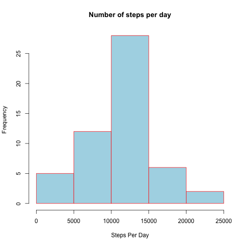
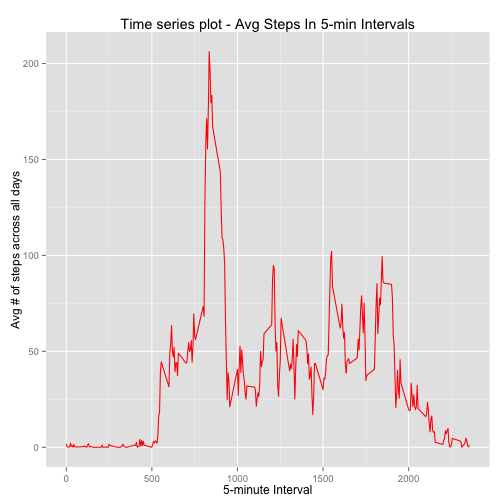
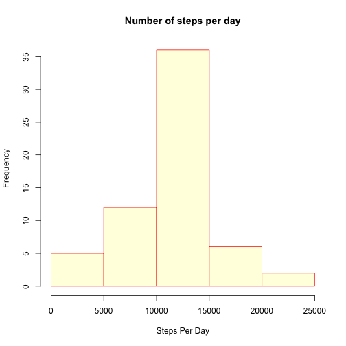
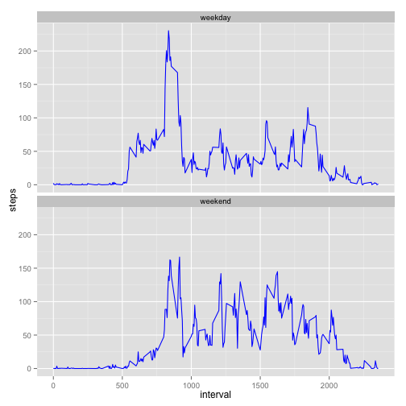

# Reproducible Research - Peer Assignment 1

It is now possible to collect a large amount of data about personal movement using activity monitoring devices such as a Fitbit, Nike Fuelband, or Jawbone Up. These type of devices are part of the “quantified self” movement – a group of enthusiasts who take measurements about themselves regularly to improve their health, to find patterns in their behavior, or because they are tech geeks. But these data remain under-utilized both because the raw data are hard to obtain and there is a lack of statistical methods and software for processing and interpreting the data.

This assignment makes use of data from a personal activity monitoring device. This device collects data at 5 minute intervals through out the day. The data consists of two months of data from an anonymous individual collected during the months of October and November, 2012 and include the number of steps taken in 5 minute intervals each day.

## Data
The data for this assignment is downloaded from: Dataset: <https://d396qusza40orc.cloudfront.net/repdata%2Fdata%2Factivity.zip> [52K]

The variables included in this dataset are:

- steps: Number of steps taking in a 5-minute interval (missing values are coded as NA)

- date: The date on which the measurement was taken in YYYY-MM-DD format

- interval: Identifier for the 5-minute interval in which measurement was taken

The dataset is stored in a comma-separated-value (CSV) file and there are a total of 17,568 observations in this dataset.

## Loading and preprocessing the data


```r
library(ggplot2)
library(knitr)
opts_chunk$set(echo = TRUE, results = 'hold')
```

Load data using read.csv()


```r
actData <- read.csv("activity.csv", sep = ",")
```

Convert the steps, date and interval columns to the desired data types

```r
actData$date <- as.Date(actData$date, format = "%Y-%m-%d")
actData$steps <- as.numeric(actData$steps)
actData$interval <- as.numeric(actData$interval)
```
Lets check data at this point.


```r
head(actData, 10)
```

```
##    steps       date interval
## 1     NA 2012-10-01        0
## 2     NA 2012-10-01        5
## 3     NA 2012-10-01       10
## 4     NA 2012-10-01       15
## 5     NA 2012-10-01       20
## 6     NA 2012-10-01       25
## 7     NA 2012-10-01       30
## 8     NA 2012-10-01       35
## 9     NA 2012-10-01       40
## 10    NA 2012-10-01       45
```

## What is mean total number of steps taken per day?

### By using the aggregate function, we ignore the records which has NA values.


```r
stepsPerDay <- aggregate(steps ~ date, actData, sum)

head(stepsPerDay, 10)
```

```
##          date steps
## 1  2012-10-02   126
## 2  2012-10-03 11352
## 3  2012-10-04 12116
## 4  2012-10-05 13294
## 5  2012-10-06 15420
## 6  2012-10-07 11015
## 7  2012-10-09 12811
## 8  2012-10-10  9900
## 9  2012-10-11 10304
## 10 2012-10-12 17382
```

### Make a histogram of the total number of steps taken each day

```r
hist(stepsPerDay$steps, col = "lightblue", border = "red", main = paste("Number of steps per day"), xlab = "Steps Per Day")
```

 

### Mean and median of the total number of steps taken per day

```r
meanSteps <- mean(stepsPerDay$steps, na.rm = TRUE)
medianSteps <- median(stepsPerDay$steps, na.rm = TRUE)
```

The mean steps per day is 1.0766189 &times; 10<sup>4</sup> and the median steps per day is 1.0765 &times; 10<sup>4</sup>

## What is the average daily activity pattern?

### Aggregate the data by steps taken in 5 minute intervals.

```r
stepsPerInterval <- aggregate(actData$steps, by = list(interval = actData$interval), FUN=mean, na.rm = TRUE)

colnames(stepsPerInterval) <- c("interval", "steps")
```

### Make a time series plot of the 5-minute interval (x-axis) and the average number of steps taken, averaged across all days (y-axis)

```r
ggplot(stepsPerInterval, aes(x=interval, y=steps)) +   
        geom_line(color="red") +  
        labs(title="Time series plot - Avg Steps In 5-min Intervals", x="5-minute Interval", y="Avg # of steps across all days")
```

 

### Maximum average number of steps in 5-minute interval across all days.

```r
maxAvgSteps <- stepsPerInterval[which.max(stepsPerInterval$steps), ]
maxAvgSteps$steps <- as.integer(maxAvgSteps$steps)
```
The 835 interval has the maximum 206 steps.

## Imputing missing values


```r
missingVals <- sum(is.na(actData$steps))
```
Total number of missing values in the data set are 2304

### Devise a strategy to fill in the missing values. The strategy used below is to use the avg steps per interval to fill in the missing values.

```r
fillMissingVals <- function(data, steps_per_interval){
        naIndex <- which(is.na(data$steps))
        
        naReplace <- unlist(lapply(naIndex, FUN=function(index){
                        interval = data[index, ]$interval
                        steps_per_interval[steps_per_interval$interval == interval, ]$steps
                }
                ))
        fillMissingSteps <- data$steps
        fillMissingSteps[naIndex] <- naReplace
        fillMissingSteps
}

noMissingSteps <- data.frame(steps = fillMissingVals(actData, stepsPerInterval), date = actData$date, interval = actData$interval)
```
Lets check if there are any missing steps

```r
str(noMissingSteps)

missingSteps <- sum(is.na(noMissingSteps))
```

```
## 'data.frame':	17568 obs. of  3 variables:
##  $ steps   : num  1.717 0.3396 0.1321 0.1509 0.0755 ...
##  $ date    : Date, format: "2012-10-01" "2012-10-01" ...
##  $ interval: num  0 5 10 15 20 25 30 35 40 45 ...
```
Total number of missing steps are 0.


### Make a histogram of the total number of steps taken each day.

```r
noMissingStepsPerDay <- aggregate(steps ~ date, noMissingSteps, sum)

## Plot the desired histogram
hist(noMissingStepsPerDay$steps, col = "lightyellow", border = "red", main = paste("Number of steps per day"), xlab = "Steps Per Day")
```

 

### Calculate and report the mean and median total number of steps taken per day

```r
meanStepsFilledEmptyVals <- mean(noMissingStepsPerDay$steps, na.rm = TRUE)
medianStepsFilledEmptyVals <- median(noMissingStepsPerDay$steps, na.rm = TRUE)
```

The mean steps per day is 1.0766189 &times; 10<sup>4</sup> and the median steps per day is 1.0766189 &times; 10<sup>4</sup>

### Do these values differ from the estimates from the first part of the assignment?

They differ slightly:

- Data with missing steps, Mean was 1.0766189 &times; 10<sup>4</sup> and Median was 1.0765 &times; 10<sup>4</sup>
        
- Data with no missing steps, Mean is 1.0766189 &times; 10<sup>4</sup> and Median is 1.0766189 &times; 10<sup>4</sup>

After filling up the missing values for steps, the mean and median have the same values.

### What is the impact of imputing missing data on the estimates of the total daily number of steps?

As seen from the calculations above, after filling in the missing steps per interval, the average of the stpe taken per 5-minute rermains the same, but the median for the same has chnaged and is now equal to the mean.

## Are there differences in activity patterns between weekdays and weekends?

- Create a new variable(column) in the dataset with no missing values.
- This new column will indicate whether a day is a weekday or a weekend.


```r
noMissingSteps$Day[weekdays(as.Date(noMissingSteps$date)) %in% c("Saturday", "Sunday")] <- "weekend"

noMissingSteps$Day[!weekdays(as.Date(noMissingSteps$date)) %in% c("Saturday", "Sunday")] <- "weekday"

noMissingSteps[, 4] <- as.factor(noMissingSteps[, 4])
```
        
### Make a panel plot containing a time series plot of the 5-minute interval (x-axis) and the average number of steps taken, averaged across all weekday days or weekend days (y-axis).

```r
aggrSteps <- aggregate(steps ~ interval + Day, data=noMissingSteps, FUN=mean)
ggplot(aggrSteps, aes(x=interval, y=steps, group=1)) + geom_line(color = "blue") +
  facet_wrap(~ Day, ncol=1)
```

 

        
        
        
        
        
        
